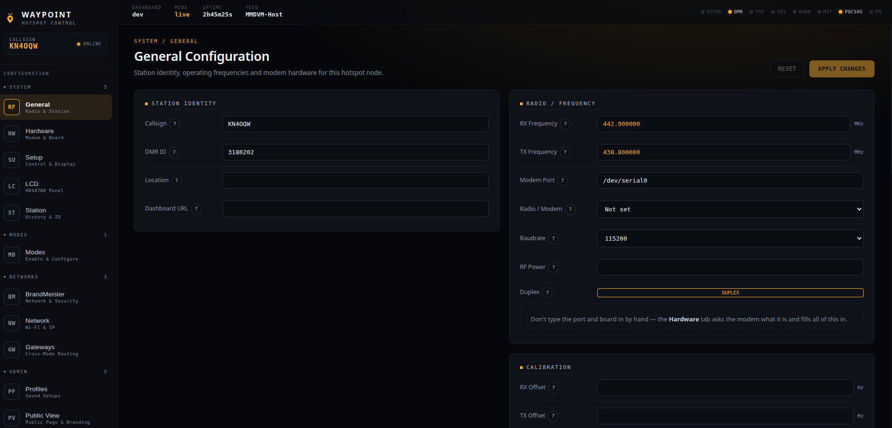
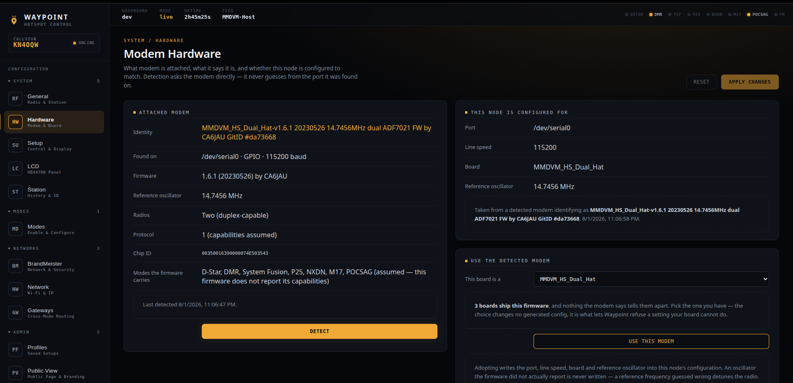
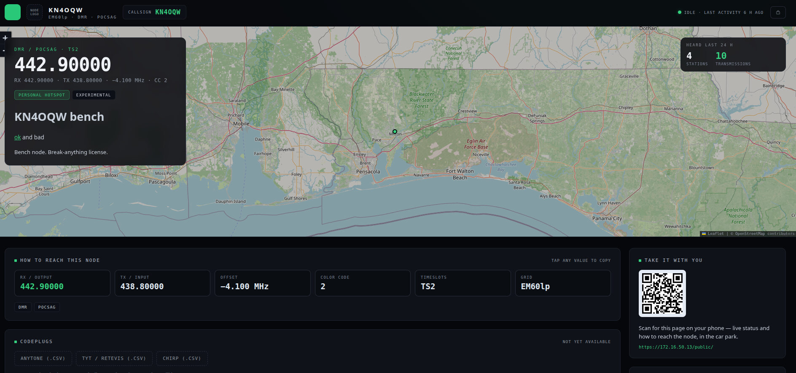

# Waypoint

**An open, community-governed host system and UI for MMDVM digital voice hotspots.**

Waypoint is a ground-up hotspot host system for amateur radio digital voice — DMR,
YSF, D-Star, P25, NXDN, POCSAG and beyond — built on the public
[g4klx](https://github.com/g4klx) GPL stack and the new MQTT data plane of
[MMDVM-Host](https://github.com/g4klx/MMDVM-Host).



It exists because the amateur community deserves a hotspot platform that is:

- **Lossless** — configuration is a schema-versioned store; applying a change never destroys another setting. Gateway INI files are generated artifacts, not the source of truth.
- **Honest about status** — the dashboard consumes structured MQTT/JSON events. No log scraping, no "shows Not Linked while linked."
- **Secure by default** — no default credentials, HTTPS out of the box, a real security-reporting channel.
- **Safe to update** — updates are atomic or they don't happen, and your local customizations live in a documented override layer that survives every one.
- **Usable from your phone** — responsive to 360 px, dark-default with a real light theme, and a first-run claim you can complete one-handed.
- **Governed to outlive any one person** — public repos, public CI, a review SLA, and a written no-telemetry policy. See [GOVERNANCE.md](GOVERNANCE.md).

## Quick start

The easiest way to run Waypoint is the ready-to-flash SD-card image (Raspberry Pi
OS Lite Bookworm + the full stack):

1. Download `waypoint-<version>-bookworm-<arch>.img.xz` and `SHA256SUMS` from the
   [latest release](https://github.com/KN4OQW/waypoint/releases/latest), and
   verify them: `sha256sum -c SHA256SUMS` and `minisign -Vm SHA256SUMS -P <release key>`.
2. Flash with **Raspberry Pi Imager** (Use custom → the `.img.xz`). In Imager's
   advanced options set your **Wi-Fi and a username/password** — the image ships
   no default login.
3. Boot the Pi, browse to **`https://<address>/`**, and complete the one-time
   claim to set your Waypoint admin account.

Pick **arm64** on a Pi 3/4, **armhf** for a Pi Zero 2 W / 2 / 3 (32-bit). Pi Zero
W and Pi 1 are not supported. Full flashing and first-boot walk-through:
**[docs/image.md](docs/image.md)**.

**Locked out?** A Waypoint password cannot be recovered — it is stored only as a
hash — but you can take a node back with a shell on it (`sudo waypointd
reset-claim`) or with its SD card in a reader. Both routes are in
**[docs/recovery.md](docs/recovery.md)**, and on the node's own login screen,
which is where you will be when you need them.

## What it does

The highlights. The complete inventory, with design records and issue links, is in
**[docs/features.md](docs/features.md)**.

### Your settings are a store, not a pile of INI files

A schema-versioned store is authoritative and every gateway's `.ini` is a compiled
output of it, so changing one thing cannot silently drop another. Hand-edits belong
in an [override layer](docs/features.md#configuration) that merges last and survives
updates. Save a whole setup as a named **profile** and switch between them in a
click, or **import an existing Pi-Star or WPSD card** and keep what's on it.

### Cross-mode buses, not a grid of bridges

A *bus* is a named object you attach modes to. Voice entering from any attached mode
is converted and emitted to every other, with IDs, callsigns and talkgroups
translated per destination — one bus instead of a matrix of `YSF2DMR`/`DMR2YSF`
daemons. A bus can also span **more than one Waypoint node on your LAN** over a
mutually-authenticated link, so the garage YSF node and the shack DMR node work as
one without touching a reflector or the internet.

### Text messages, sent by the node itself

Type a message on the node and it goes out over your own RF to a radio — no
BrandMeister, no reflector, nothing upstream involved. Messages the node sees in
either direction are recorded and served over an authenticated API, so a club
bot or a script can read and send them. Sending waits for a clear timeslot,
because MMDVM-Host *discards* a network frame that arrives over somebody's
transmission rather than queuing it, and a message thrown at a busy channel is
silently lost.

Nothing here claims more than it knows: unconfirmed DMR data carries no
acknowledgement, so a sent message reads **sent**, never *delivered*. It is
**off by default** — relaying the DMR loopback puts Waypoint in the path of
every DMR frame, which is a trade you should make deliberately. Messages are
never public and appear in no public-view response.

One thing no hotspot can do for you: the receiving radio's channel must be set
to **M-SMS format with APRS Receive OFF**. Anytone and BTECH firmware treats the
two as mutually exclusive, and with APRS receive on the radio decodes the
message, lights up, and discards it. See [docs/messages-api.md](docs/messages-api.md).

### The dashboard tells the truth

Status is folded server-side from the host stack's structured MQTT events into one
authoritative value, streamed to the browser and republished for **Home Assistant**
with zero YAML. A stranded transmission expires on a watchdog and a killed gateway
shows down within about a second, so nothing latches stale. Every event is persisted,
so history is the same in every browser regardless of when it connected.

### The node handles its own hardware



Waypoint **asks the modem what it is** instead of guessing from the port it appeared
on, and tells you when a correctly fitted hat is mute because Bluetooth owns the UART.
It **flashes firmware** on GPIO hats from a button — no SSH, no `stm32flash`, and an
interrupted flash is recoverable by retry. And it **calibrates itself**: press start,
key your radio when asked, and watch the bit error rate fall as the node sweeps its
own reference oscillator and keeps the offset that won. Nothing else automates that.

### An optional public page for your node



Publish a read-only page saying how to actually work your node — frequencies, colour
code, timeslots, grid, nets, links — plus recent callsigns, a JSON API and a drop-in
`<iframe>` widget for a club website. It is **off by default and every route answers
`404` until you turn it on**, and it publishes callsigns and nothing else: no
duration, BER, talkgroup for a heard station, version string, IP, or location finer
than a 6-character grid square. Those fields do not exist in the responses.
See [docs/public-api.md](docs/public-api.md).

### Updates that complete or don't happen

Releases are signed (minisign/Ed25519) and verified before they are applied. The new
binary is staged and atomically swapped with the old one kept as a rollback, then
health-gated — if it doesn't come up healthy it reverts itself, including after a
power cut mid-update. The same confirm-or-revert discipline covers the mode daemons,
which arrive as signed apt packages. HTTPS is on from first boot with a per-device
certificate, so your claim password never crosses the network in the clear.

## Status

**Active development.** The config core, the full mode stack, cross-mode buses, LAN
peering, host networking, modem detection, firmware flashing, guided calibration,
DMR text messaging and the public page are in place, with per-mode, two-node and
on-hardware runs validated on the bench. All eight mode daemons are built, signed,
published and — as of the POCSAG close-out
([#33](https://github.com/KN4OQW/waypoint/issues/33)) — *delivered*: installed over
apt by Waypoint's own updater on a real node, which is a different claim from "the
package exists" and is the one that had never been tested.

Text messaging went the same route. The codec is a port of the g4klx FEC and PDU
layers checked byte-for-byte against them, but the SMS dialect above it came from
no specification — it was reverse-engineered from captures, because the published
formats describe several plausible alternatives and the radio accepts none of them.
It is validated end to end on the bench: messages displayed on a real BTECH 6X2 Pro
at one block and at the 123-unit maximum, inbound captured while the same
message still reached BrandMeister, and voice through the relay at **0% packet loss
and BER 0.0%** — identical to the same node without it. The run is written up,
including the two items that did *not* go as planned, in
[docs/validation/messages-hardware.md](docs/validation/messages-hardware.md).

The first flashable SD-card image ships as **`v1-initialimg`**, built end-to-end by
public CI for arm64 and armhf. The
[requirements register](https://github.com/KN4OQW/waypoint/issues?q=is%3Aissue+label%3Atype%3Arequirement)
is imported — every item carries provenance back to the community complaint or
upstream issue that motivated it — and everything is public from the first commit.

**Still ahead:** the cross-**codec** bus path (the AMBE+2 reframe envelope ships, so
DMR/YSF-DN/NXDN interoperate, but a vocoder-crossing attachment is refused outright
rather than half-working); carrying text **across a bus** — the DMR text plane exists
now, but bridging it to a mesh radio or a second node, and the local map that goes
with it, do not ([#85](https://github.com/KN4OQW/waypoint/issues/85)); the full-size MMDVM
([#25](https://github.com/KN4OQW/waypoint/issues/25)) and DVMega
([#26](https://github.com/KN4OQW/waypoint/issues/26)) board tiers; flashing **USB
stick boards**, which is designed but deliberately unbuilt because they are the only
boards a flash can brick and none has reached a bench yet
([RFC-0020](https://github.com/KN4OQW/waypoint/discussions/176)); and a read-only
root with **A/B slots and automatic rollback**
([RFC-0017](https://github.com/KN4OQW/waypoint/discussions/172), design).

**Caveats, stated plainly:**

- Peering is **LAN-only by design** — no WAN/Internet mesh, no owner failover.
- `v1-initialimg` is an **initial** image: flashable and complete, but early. Treat it as a beta while it takes on hardware miles.
- **Open defects the bench found and we have not yet fixed** are worth knowing before you lean on a mode: no YSF startup reflector links, because the picker stores a name YSFGateway cannot resolve ([#146](https://github.com/KN4OQW/waypoint/issues/146)); a DMR transmission to a secondary network kills the next one to the primary ([#144](https://github.com/KN4OQW/waypoint/issues/144)); and an unset frequency crash-loops YSFGateway and MMDVM-Host with no visible cause instead of being refused up front ([#145](https://github.com/KN4OQW/waypoint/issues/145), [#215](https://github.com/KN4OQW/waypoint/issues/215), [#216](https://github.com/KN4OQW/waypoint/issues/216)).
- **Accessibility is a merge gate, and it passes.** It had been passing *vacuously* — the daemon never started under the `axe` job, so nothing was scanned. Fixing that exposed 98 violations across 51 pages ([#121](https://github.com/KN4OQW/waypoint/issues/121)), largely light-mode contrast; those are now cleared. The current full run is **294 pages across three themes and both light and dark, zero violations**. That is a floor, not a certificate: axe catches what axe catches, and no automated scan is a substitute for someone using the thing with a screen reader.

Reference bench hardware: MMDVM_HS_Dual_Hat (STM32F103, dual ADF7021) on a Raspberry
Pi 3, running Waypoint's own [MMDVM_HS](https://github.com/KN4OQW/MMDVM_HS) firmware
build, plus full-size MMDVM (STM32F4/F7) targets.

## Architecture (short version)

```
Radio (MMDVM_HS / MMDVM firmware)
  ↕ serial
g4klx host stack (MMDVM-Host + mode gateways, unmodified)
  ↕ MQTT (mosquitto, JSON events)
waypointd — Go core daemon
  · schema-versioned config store (SQLite in /var/lib/waypoint); INIs are compiled outputs
  · service supervisor (mode gateways + per-bus hub daemons) with reconnect policies
  · hardware ops: board detect, firmware flash (GPIO hats), guided calibration
  · DMR text messages: a codec, and (opt-in) a relay on the MMDVM-Host ↔ DMRGateway
    loopback so the node can originate a data burst of its own
  · REST + WebSocket API (the dashboard is just the first client)
  ↕ HTTPS
Web UI — responsive SPA, embedded in the daemon binary
```

Full detail: [docs/architecture.md](docs/architecture.md).

## Contributing

Start with [CONTRIBUTING.md](CONTRIBUTING.md). The short version: every PR gets a
human response within 14 days — even if it's "no, and here's why." Every behaviour
change ships with tests, and any check that tells an operator something is wrong
cites the upstream line or field width it rests on. Requirement issues labeled
`good-first-issue` are curated for newcomers. Feature-scale changes start as an
issue — the [RFC process](GOVERNANCE.md#rfcs) is dormant until v1, because a comment
period needs a community to comment.

This project also runs AI-assisted triage (Claude): new issues and PRs get an initial
technical read within minutes, and you can mention `@claude` in any thread for
interactive help. AI never merges; maintainers do.

## License

GPL-3.0. The bundled g4klx components are GPL-2.0-or-later. Documentation is
CC-BY-SA-4.0.

---

*Waypoint is an independent community project. It reuses no code from Pi-Star or
WPSD and is not affiliated with either; we're grateful to both for years of service
to the hobby, and to Jonathan Naylor G4KLX, whose stack makes all of this possible.*
