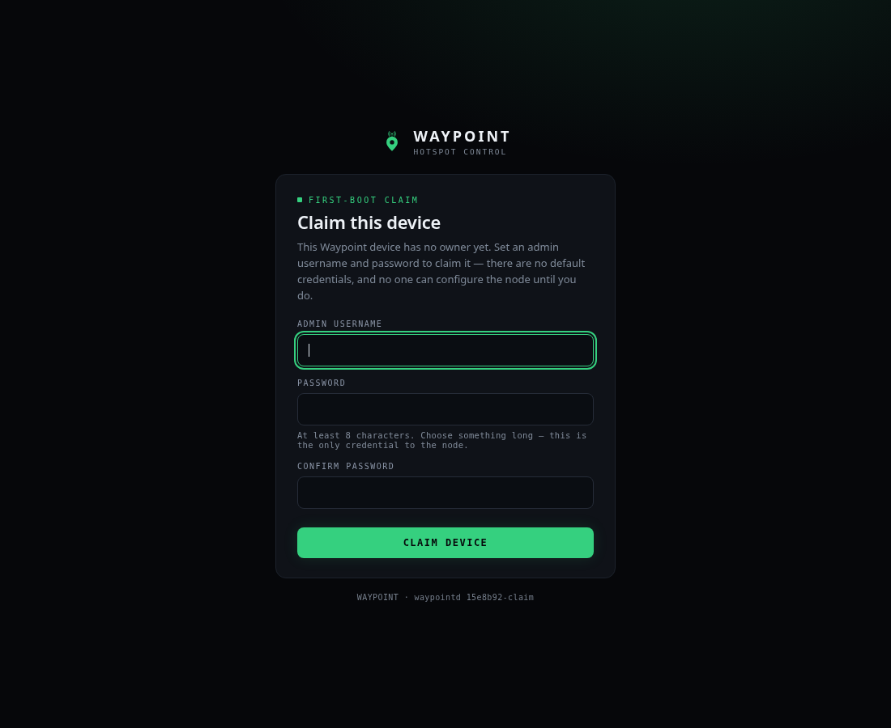
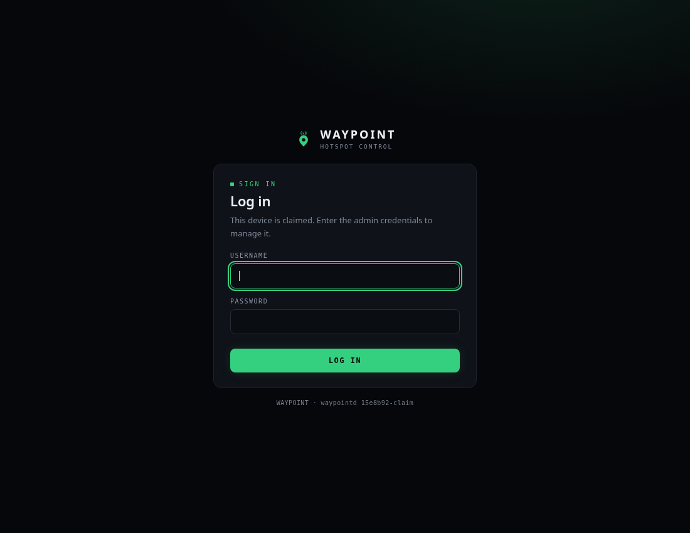

# First-boot device claim — hardware validation

**Feature:** first-boot device claim + sessions + reset (RFC-0002)
**Requirement:** [issue #10](https://github.com/KN4OQW/waypoint/issues/10) — *First-boot device claim — no default credentials*
**Branch under validation:** `feat/claim-login-ui` (the integration branch carrying the five RFC-0002 commits `f2c6658 → 15e8b92`; **not yet merged to `main`** at the time of this run)
**Date:** 2026-07-19
**Bench:** Raspberry Pi 3 Model B Rev 1.2 + MMDVM_HS_Dual_Hat, at `pi-star@172.16.50.13` (DEV box)
**Tester workstation:** curl / headless-chromium against `http://172.16.50.13` (port 80, plain HTTP — pre-TLS build)

## Verdict

| Phase | Area | Result |
|------:|------|:------:|
| 1 | Recon | ✅ PASS |
| 2 | Backup | ✅ PASS |
| 3 | Deploy (`GOARM=7`) | ✅ PASS |
| 4 | Fresh-claim matrix (a–e) | ✅ PASS |
| 5 | Session persistence across restart | ✅ PASS |
| 6 | Reset path A (`reset-claim`) | ❌→✅ **FAIL on first run — bug found & fixed; re-validated PASS** |
| 7 | Reset path B (boot marker + reboot) | ✅ PASS |
| 8 | Secret-leak check | ✅ PASS |
| 9 | Exit state | ✅ PASS |

**One real bug found and fixed** during phase 6 (stale claim-state cache after an out-of-process `reset-claim`). Fix + regression test committed on this branch and re-validated on hardware. Issue #10's acceptance — *"a fresh install exposes zero authenticated surfaces before claim; config requires auth by default afterward"* — is **met**.

**Plus one CI-flake fix** surfaced while getting this PR green: the `auth-flows` UI job failed intermittently on a Playwright navigation race (not a product bug) — [`ui/tests`](https://github.com/KN4OQW/waypoint/commit/2e7b728) makes it deterministic. See [CI note](#ci--the-auth-flows-flake) at the end.

---

## Deviations from the task brief (environment facts)

These are not defects in the feature; they are places where the bench reality differed from the brief's assumptions. Recording them so the next run is not surprised.

| Brief assumption | Reality on the bench | Handling |
|---|---|---|
| Store at `/var/lib/waypoint/config.db` | Store is at **`/home/pi-star/waypoint/config.db`**; `/var/lib/waypoint/` does not exist. This matches the daemon's and `reset-claim`'s compiled-in default (`-store`). | Backed up and dumped the real path. |
| `GOOS=linux GOARCH=arm GOARM=7` | Kernel is 64-bit (`aarch64`) but **userspace is 32-bit `armhf`** (`getconf LONG_BIT` = 32). `GOARM=7` (armv7 hard-float) is therefore the correct target and matches userspace. (The *previously* installed binary was, oddly, an `arm64` static build that ran only because the kernel is 64-bit.) | Built `GOARM=7`; runs cleanly. |
| `/boot` vs `/boot/firmware` | **`/boot/firmware`** is the mounted FAT partition (`/dev/mmcblk0p1`, vfat). `/boot` is on the root ext4 and is not a separate mount. | Reset marker placed on `/boot/firmware/waypoint-reset`. |

---

## Phase 1 — Recon

```
model     : Raspberry Pi 3 Model B Rev 1.2   host: wpsd
os        : Raspbian GNU/Linux 13 (trixie)   kernel aarch64 / userspace armhf (LONG_BIT=32)
unit      : waypointd.service — active (running), User=root
ExecStart : /home/pi-star/waypoint/bin/waypointd -addr 0.0.0.0:80 -mqtt-broker 127.0.0.1:1883 -mqtt-name mmdvm
store     : /home/pi-star/waypoint/config.db  (+ -wal 1.24 MB, + -shm)   [NOT /var/lib/waypoint]
installed : waypointd 9768d40-lcd2 — pre-claim build (no `reset-claim` subcommand, no claim gate)
boot part : /boot/firmware (vfat, /dev/mmcblk0p1)
sqlite3   : CLI not installed → used python3 sqlite3 (3.46.1) for dumps
```

The installed `9768d40-lcd2` build predates RFC-0002 (no gate, no `reset-claim`), confirming phase 3 is a genuine feature deployment.

## Phase 2 — Backup

```
sudo systemctl stop waypointd            # clean stop → consistent copy
mkdir -p /home/pi-star/waypoint-backup-2026-07-19_100817/etc
cp -a config.db config.db-wal config.db-shm  <backup>/     # all three — see note
cp -a etc/*.ini etc/dstargateway.cfg         <backup>/etc/
cp -a /etc/systemd/system/waypointd.service  <backup>/waypointd.service
cp -a bin/waypointd                          <backup>/waypointd.oldbin
```

> **Backup-integrity note.** `waypointd` runs SQLite in **WAL mode and does not checkpoint on close** — even after a clean `systemctl stop`, `config.db` stays a 4 KB stub while the live data sits in the 1.24 MB `config.db-wal`. A `cp config.db` alone (as the brief's one-liner and the pre-existing `waypoint-backup-2026-07-13` backup both did) captures a **near-empty** store. This backup and `restore.sh` copy **db + wal + shm together with the daemon stopped**. Not a claim-feature bug, but a real operational trap worth flagging for the backup/updates lifecycle work.

**Restore one-liner** (records in `~/.last_waypoint_backup`):

```bash
sudo /home/pi-star/restore.sh                      # defaults to the recorded backup dir
# equivalent manual form:
sudo systemctl stop waypointd && \
  sudo cp -a /home/pi-star/waypoint-backup-2026-07-19_100817/config.db{,-wal,-shm} /home/pi-star/waypoint/ && \
  sudo systemctl start waypointd
```

## Phase 3 — Deploy (cross-compiled release)

```bash
CGO_ENABLED=0 GOOS=linux GOARCH=arm GOARM=7 go build -trimpath \
  -ldflags "-s -w -X main.Version=<sha>-claim" -o waypointd ./cmd/waypointd
# → ELF 32-bit LSB executable, ARM, EABI5, statically linked  (modernc/sqlite = pure Go, no cgo)
sudo install -m0755 waypointd /home/pi-star/waypoint/bin/waypointd
sudo systemctl restart waypointd
```

Startup log confirms the gate is armed:

```
waypointd 15e8b92-claim (live, mqtt 127.0.0.1:1883, UNCLAIMED (serving claim mode only)) listening on http://0.0.0.0:80
```

`GET /api/health` → `200 {"status":"ok","version":"15e8b92-claim","claimed":false}`. (Final re-validated build after the phase-6 fix is `a31f079-claim`.)

## Phase 4 — Fresh-claim matrix (issue #10 acceptance)

**4a — fresh device → claim mode.** Stopped the daemon, moved `config.db{,-wal,-shm}` aside, started → the daemon created a new empty store, seeded defaults from the on-disk INIs, and came up `UNCLAIMED (serving claim mode only)`, `claimed:false`.

**4b — unclaimed matrix** (`http://172.16.50.13`, no cookie). Every config/event/network surface is denied `403` with `{"error":"device is unclaimed","mode":"claim"}`; only health answers:

```
METHOD PATH                       CODE
GET    /api/config                403
POST   /api/config/apply          403
GET    /api/events                403
PUT    /api/config/general        403
GET    /api/network/status        403
GET    /api/dmr/masters           403
GET    /api/ysf/reflectors        403
GET    /api/health                200   (pre-auth allow)
```

**4c — claim + conflict.**

- `POST /api/claim` (first) → **`201 Created`**, `Set-Cookie: waypoint_session=…; Path=/; Max-Age=604800; HttpOnly; SameSite=Lax`, body `{"claimed":true}`. ✅ (No `Secure` flag — correct for the pre-TLS build; `-secure-cookie` defaults off until the TLS PR.)
- **409 semantics — verified both reachable paths:**
  - *Authenticated re-claim* (`POST /api/claim` **with** the winner's cookie) → **`409` `{"error":"device already claimed"}`**. ✅
  - *Concurrent race* (two simultaneous `POST /api/claim` on a fresh device) → exactly **one `201`, one `409`**. ✅ (The store serializes on the fixed admin `id=1`.)
  - *Sequential unauthenticated re-claim* (`POST /api/claim`, no cookie, device already claimed) → **`401` `mode:login`**, **not 409**. This is correct and by design: once claimed, the gate's claimed branch only pre-authorizes `POST /api/session`, so an unauthenticated re-claim is turned away at the wall before reaching the 409 handler. It still satisfies issue #10 (no second unauthenticated claim can succeed) and matches the feature's own `TestClaimValidationAndConflict`. The brief's "second claim → 409" is thus satisfied by the authenticated and race paths above.

**4d — matrix without / with the session cookie.**

| Route | no cookie | with cookie |
|---|:---:|:---:|
| `GET /api/config` | 401 | **200** (serves real config — `callsign KN4OQW`, `dmr_id 3180202`) |
| `GET /api/network/status` | 401 | 200 |
| `GET /api/dmr/masters` | 401 | 200 |
| `GET /api/ysf/reflectors` | 401 | 200 |
| `GET /api/events` (SSE) | 401 | 200 (stream) |
| `GET /api/health` | 200 | 200 |

Unauthenticated bodies are `{"error":"authentication required","mode":"login"}`. ✅

**4e — browser pass** (headless chromium, real render of the served UI `AuthPage`, which branches on `/api/health`'s `claimed` flag):

- Unclaimed device → **claim screen** renders: "FIRST-BOOT CLAIM / Claim this device", admin username + password (8-char minimum hint) + confirm, "there are no default credentials". 
- Claimed device → **login screen** renders: "SIGN IN / Log in", "This device is claimed." 
- **Login/logout** (the browser's underlying calls):
  - `POST /api/session` correct creds → `200 {"authenticated":true}` + fresh cookie; that cookie → `GET /api/config` `200`.
  - `POST /api/session` wrong password → `401`.
  - `DELETE /api/session` → `204`, `Set-Cookie …; Max-Age=0`; the revoked cookie is then **server-side dead** → `GET /api/config` `401` (revocation, not merely a dropped cookie). ✅

## Phase 5 — Session persistence across restart

Sessions are SQLite-backed (`sessions` table keyed by SHA-256 of the token), so they must survive a daemon restart.

```
before restart:  claim cookie → GET /api/config = 200 ;  sessions rows = 1
sudo systemctl restart waypointd
after  restart:  same cookie  → GET /api/config = 200 ;  health uptime = 3s (restart confirmed)
```

✅ PASS — the same cookie is honored across the restart.

## Phase 6 — Reset path A (`waypointd reset-claim`) — **bug found, fixed, re-validated**

**First run (deployed `15e8b92-claim`) — FAIL.** With the daemon **running**, `sudo waypointd reset-claim`:

```
reset-claim: wiped admin credential (admin "wpadmin"), revoked 1 session(s), cleared claimed_at —
             device returned to claim mode (store /home/pi-star/waypoint/config.db)
```

The **store** was correctly reset (`admin=0, sessions=0, claimed_at=NULL`, verified via sqlite). But the **live daemon kept serving the claimed experience** — the matrix returned `401 mode:login` (not `403 mode:claim`) and `/api/health` still reported `claimed:true`:

```
GET /api/config  → 401  {"error":"authentication required","mode":"login"}      # WRONG: expected 403 mode:claim
```

Old cookies *were* rejected (session rows were wiped and are checked live), but the device was left demanding a **login for a credential that no longer exists anywhere** — and, because the claimed gate refuses `POST /api/claim`, it could **not be re-claimed either**. The box was effectively locked out until `systemctl restart` (which, once run, corrected everything: `claimed:false`, matrix `403 mode:claim`).

### Root cause

`Auth` caches the claim state (`a.claimed`, read on every request) and invalidates it only on the daemon's **own** claim and boot-marker reset. The `reset-claim` **subcommand is a separate process**: it writes the shared store directly and cannot reach into the running daemon's memory, so the cache goes stale (`claimed=true`). The feature's existing `TestResetClaimSubcommand` missed this because it *closes the store and rebuilds the `Auth`* before re-checking — i.e. it only ever exercised the **restart** path, never a live daemon.

### Fix — commit [`a31f079`](https://github.com/KN4OQW/waypoint/commit/a31f079) `internal/auth: reconcile the claim cache with the store on the deny path`

On the gate's **unauthenticated deny path** (the cold path reached only after authentication has already failed — never the authenticated hot path), re-read the store's claim state; if it now says unclaimed, drop the stale cache and hand the request to the claim-mode handler. The first request after an out-of-process reset self-heals the daemon back to claim mode. A store read error leaves the cache untouched (fail toward requiring auth). Ships with a regression test that drives **one warm-cache `Auth`** through a live `reset-claim`.

### Re-validation (deployed `a31f079-claim`, daemon **running**, **no restart**)

```
sudo waypointd reset-claim         # revoked 2 session(s), cleared claimed_at
# immediately, no restart:
GET /api/config            → 403  {"error":"device is unclaimed","mode":"claim"}   ✅
GET /api/network/status    → 403
GET /api/events            → 403
GET /api/dmr/masters       → 403
GET /api/health            → 200  {"claimed":false}                                ✅
old winner cookie          → 403  (rejected, now in claim mode)                    ✅
# re-claim:
POST /api/claim (wpadmin)  → 201                                                   ✅
```

✅ PASS after the fix. *(Lower-severity symmetric note, not fixed here: the mirror-image staleness — cache says "unclaimed" after the device is claimed by another process — is benign: `/api/claim` correctly returns `409` and config stays `403` until the cache reloads.)*

## Phase 7 — Reset path B (boot-partition marker + reboot)

The daemon checks `/boot/waypoint-reset` and `/boot/firmware/waypoint-reset` at startup. Placed the marker on the real FAT partition and power-cycle-equivalent rebooted:

```
sudo touch /boot/firmware/waypoint-reset      # /dev/mmcblk0p1 vfat
sudo systemctl reboot
```

On boot (from the daemon journal, this boot):

```
SECURITY: boot-partition reset marker /boot/firmware/waypoint-reset found — returning device to the unclaimed state
SECURITY: reset complete — admin credential wiped, all sessions revoked, claim mode restored; marker /boot/firmware/waypoint-reset deleted
```

Post-reboot verification:

```
marker /boot/firmware/waypoint-reset  → deleted (No such file)     ✅
/api/health                           → claimed:false               ✅
store                                 → admin=0 sessions=0 claimed_at=NULL   ✅
unclaimed matrix                      → 403 mode:claim across the board       ✅
POST /api/claim (wpadmin)             → 201                          ✅
```

✅ PASS.

> **Bench note (not a feature bug):** `waypoint-m17gateway.service` is **`disabled`** on this box (all other gateways are `enabled`), so the reboot did not auto-start it although it had been running manually at recon. Restored it with `systemctl start` in phase 9. Worth enabling for parity if M17 is meant to be persistent on this node.

## Phase 8 — Secret-leak check

Device claimed with the DEV credential, then dumped the store and grepped the journal for the **literal password**:

```
admin row:  username=wpadmin
            password_hash = iCXbaFSQP5g65i0pD4G+fg$Bb1FjsLtxI1ICTnYDgPoseK+…   (salt$hash)
            params        = argon2id$v=19$m=65536,t=1,p=4
```

- Literal password in the full `sqlite3` dump (schema + data): **absent** (`False`); brute-force scan of every text column: **no hits**.
- Raw bytes of `config.db`, `config.db-wal`, `config.db-shm`: **clean**.
- `journalctl -u waypointd` (all boots) and the **full** journal: **0 occurrences**.

✅ PASS — only the argon2id hash is persisted; the plaintext appears nowhere on disk or in logs.

## Phase 9 — Exit state

- **Config restored** to the real node config via `restore.sh` (validated end-to-end): `GET /api/config` serves `callsign KN4OQW, dmr_id 3180202`.
- **Re-claimed** with a known **DEV-only** credential (see below), `claimed:true`, running `waypointd a31f079-claim`.
- **Stack units — all active:** `mosquitto`, `waypointd`, `waypoint-mmdvm`, `waypoint-{dmr,ysf,p25,nxdn,m17,dstar}gateway`.
- **Backup + restore.sh in place:**
  - `/home/pi-star/waypoint-backup-2026-07-19_100817/` — `config.db{,-wal,-shm}`, `etc/*.ini`, `waypointd.service`, `waypointd.oldbin`
  - `/home/pi-star/restore.sh` (+ pointer in `/home/pi-star/.last_waypoint_backup`)
- Removed test scratch (`_pretest_store/`, `waypointd-armv7.new`).

### DEV-only credential (this bench, non-secret)

> **`wpadmin` / `Waypoint-DEV-2026!`** — a throwaway credential for this DEV box only. Not a production secret. Rotate or `reset-claim` before the box is used for anything real.

---

## CI — the `auth-flows` flake

The first CI run of this PR (#72) failed one `auth-flows` scenario, *"expired session → login → back to where you were"*:

```
page.evaluate: Execution context was destroyed, most likely because of a navigation
```

Investigated and confirmed it is **a test-harness race, not a product regression**:

- The scenario fires `page.evaluate(() => { fetch("/api/config"); })` to provoke a 401; the wrapped fetch then **redirects to the login page**, and that navigation can destroy the `evaluate` execution context before the call resolves.
- The phase-6 fix can only *slow* the 401 deny path (it adds one `IsClaimed()` read), so it cannot cause — and if anything reduces — this race. The scenario passed **5/5 locally** on the fixed tree; the base commit `15e8b92` passed the same job in CI. It is timing-dependent flakiness that the CI runner happened to expose.
- Fix: commit [`2e7b728`](https://github.com/KN4OQW/waypoint/commit/2e7b728) swallows only that `evaluate` rejection; the following `waitForURL(/\/\?next=/)` still asserts the redirect really happened, so a genuinely broken flow still fails.

## Fixes in this PR

| Commit | What |
|---|---|
| `a31f079` | `internal/auth`: reconcile the claim cache with the store on the deny path (the phase-6 bug) + regression test |
| `2e7b728` | `ui/tests`: de-flake the expired-session redirect race in the `auth-flows` job |

## Reproduction reference

- Cross-compile: `CGO_ENABLED=0 GOOS=linux GOARCH=arm GOARM=7 go build -trimpath -ldflags "-s -w -X main.Version=$(git rev-parse --short HEAD)-claim" -o waypointd ./cmd/waypointd`
- Unit test for the phase-6 fix: `go test ./cmd/waypointd/ -run TestResetClaimReflectedOnLiveDaemon` (fails on the pre-fix tree, passes after `a31f079`).
- Full auth suites green: `go test ./internal/auth/... ./cmd/waypointd/` + `go vet`.
